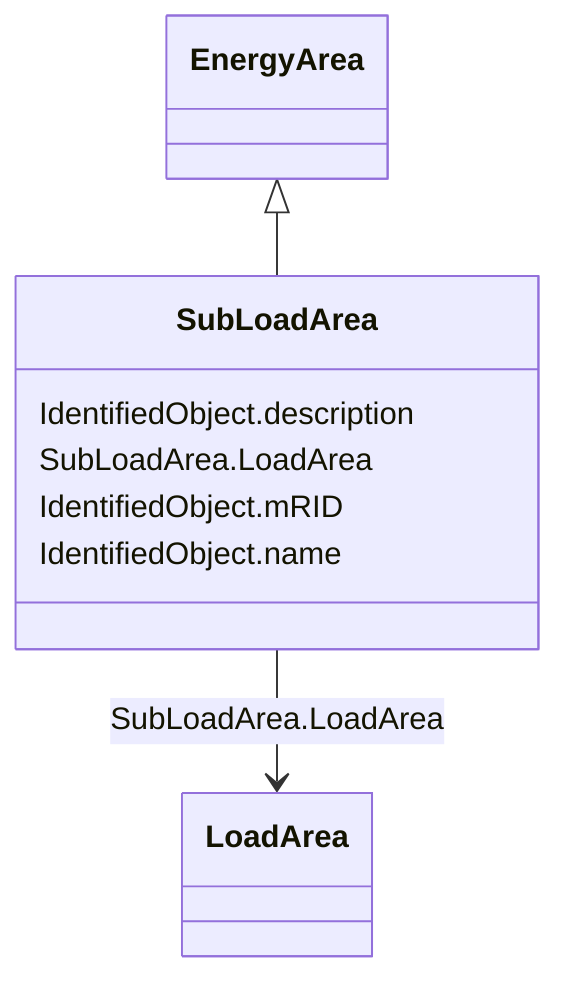

# SubLoadArea

_The class is the second level in a hierarchical structure for grouping of loads for the purpose of load flow load scaling._

**URI**: [cim:SubLoadArea](http://iec.ch/TC57/2013/CIM-schema-cim16#SubLoadArea) 
**Type**: Class

## Inheritance
* [IdentifiedObject](IdentifiedObject.md)
    * [EnergyArea](EnergyArea.md)
        * **SubLoadArea**

## Attributes

| Name | URI | Cardinality and Range | Description | Inheritance |
| ---  | --- | --- | --- | --- |
| LoadArea | [cim:SubLoadArea.LoadArea](http://iec.ch/TC57/2013/CIM-schema-cim16#SubLoadArea.LoadArea) | 1    [LoadArea](LoadArea.md)  | The LoadArea where the SubLoadArea belongs | direct |
| mRID | [cim:IdentifiedObject.mRID](http://iec.ch/TC57/2013/CIM-schema-cim16#IdentifiedObject.mRID) | 0..1    string  | Master resource identifier issued by a model authority | [IdentifiedObject](IdentifiedObject.md) |
| description | [cim:IdentifiedObject.description](http://iec.ch/TC57/2013/CIM-schema-cim16#IdentifiedObject.description) | 0..1    string  | The description is a free human readable text describing or naming the object | [IdentifiedObject](IdentifiedObject.md) |
| name | [cim:IdentifiedObject.name](http://iec.ch/TC57/2013/CIM-schema-cim16#IdentifiedObject.name) | 1    string  | The name is any free human readable and possibly non unique text naming the o... | [IdentifiedObject](IdentifiedObject.md) |

## Usages

| used by | used in | type | used |
| ---  | --- | --- | --- |
| [ConformLoadGroup](ConformLoadGroup.md) | SubLoadArea | range | [SubLoadArea](SubLoadArea.md) |
| [LoadGroup](LoadGroup.md) | SubLoadArea | range | [SubLoadArea](SubLoadArea.md) |
| [NonConformLoadGroup](NonConformLoadGroup.md) | SubLoadArea | range | [SubLoadArea](SubLoadArea.md) |

## Identifier and Mapping Information

### Schema Source

* from schema: http://iec.ch/TC57/2013/CPSM-Operation#

## Mappings

| Mapping Type | Mapped Value |
| ---  | ---  |
| self | cim:SubLoadArea |
| native | this:SubLoadArea |

