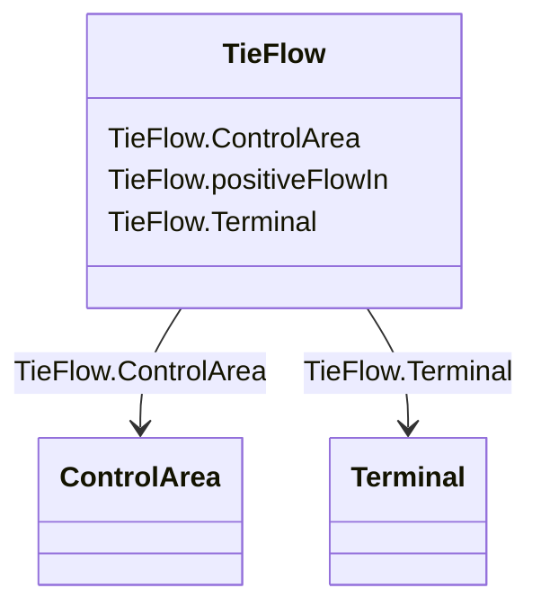

# TieFlow

_A flow specification in terms of location and direction for a control area._

**URI**: [cim:TieFlow](http://iec.ch/TC57/2013/CIM-schema-cim16#TieFlow) 
**Type**: Class

<!-- no inheritance hierarchy -->

## Attributes

| Name | URI | Cardinality and Range | Description | Inheritance |
| ---  | --- | --- | --- | --- |
| positiveFlowIn | [cim:TieFlow.positiveFlowIn](http://iec.ch/TC57/2013/CIM-schema-cim16#TieFlow.positiveFlowIn) | 1    boolean  | True if the flow into the terminal (load convention) is also flow into the co... | direct |
| ControlArea | [cim:TieFlow.ControlArea](http://iec.ch/TC57/2013/CIM-schema-cim16#TieFlow.ControlArea) | 1    [ControlArea](ControlArea.md)  | The control area of the tie flows | direct |
| Terminal | [cim:TieFlow.Terminal](http://iec.ch/TC57/2013/CIM-schema-cim16#TieFlow.Terminal) | 1    [Terminal](Terminal.md)  | The terminal to which this tie flow belongs | direct |

## Identifier and Mapping Information

### Schema Source

* from schema: http://iec.ch/TC57/2013/CPSM-Operation#

## Mappings

| Mapping Type | Mapped Value |
| ---  | ---  |
| self | cim:TieFlow |
| native | this:TieFlow |

