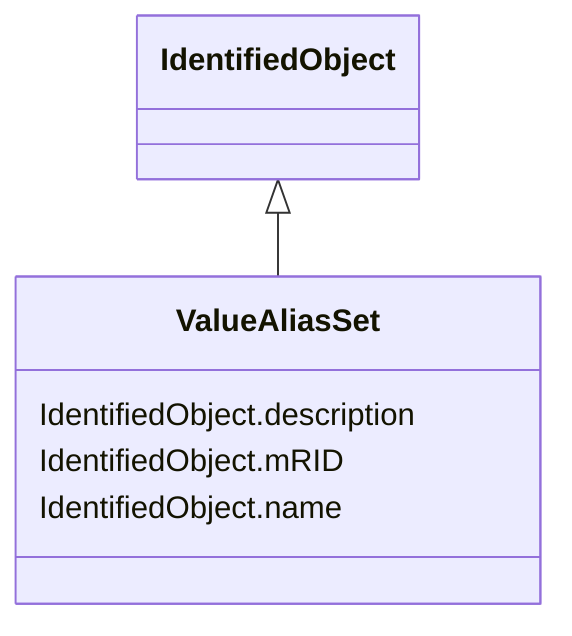

# ValueAliasSet

_Describes the translation of a set of values into a name and is intendend to facilitate custom translations. Each ValueAliasSet has a name, description etc. A specific Measurement may represent a discrete state like Open, Closed, Intermediate etc. This requires a translation from the MeasurementValue.value number to a string, e.g. 0-&gt;Invalid, 1-&gt;Open, 2-&gt;Closed, 3-&gt;Intermediate. Each ValueToAlias member in ValueAliasSet.Value describe a mapping for one particular value to a name._

**URI**: [cim:ValueAliasSet](http://iec.ch/TC57/CIM100#ValueAliasSet) 
**Type**: Class

## Inheritance
* [IdentifiedObject](IdentifiedObject.md)
    * **ValueAliasSet**

## Attributes

| Name | URI | Cardinality and Range | Description | Inheritance |
| ---  | --- | --- | --- | --- |
| mRID | [cim:IdentifiedObject.mRID](http://iec.ch/TC57/CIM100#IdentifiedObject.mRID) | 1    string  | Master resource identifier issued by a model authority | [IdentifiedObject](IdentifiedObject.md) |
| description | [cim:IdentifiedObject.description](http://iec.ch/TC57/CIM100#IdentifiedObject.description) | 0..1    string  | The description is a free human readable text describing or naming the object | [IdentifiedObject](IdentifiedObject.md) |
| name | [cim:IdentifiedObject.name](http://iec.ch/TC57/CIM100#IdentifiedObject.name) | 1    string  | The name is any free human readable and possibly non unique text naming the o... | [IdentifiedObject](IdentifiedObject.md) |

## Usages

| used by | used in | type | used |
| ---  | --- | --- | --- |
| [Command](Command.md) | ValueAliasSet | range | [ValueAliasSet](ValueAliasSet.md) |
| [Discrete](Discrete.md) | ValueAliasSet | range | [ValueAliasSet](ValueAliasSet.md) |
| [RaiseLowerCommand](RaiseLowerCommand.md) | ValueAliasSet | range | [ValueAliasSet](ValueAliasSet.md) |
| [ValueToAlias](ValueToAlias.md) | ValueAliasSet | range | [ValueAliasSet](ValueAliasSet.md) |

## Identifier and Mapping Information

### Schema Source

* from schema: http://iec.ch/TC57/2020/CPSM-Operation#

## Mappings

| Mapping Type | Mapped Value |
| ---  | ---  |
| self | cim:ValueAliasSet |
| native | this:ValueAliasSet |

