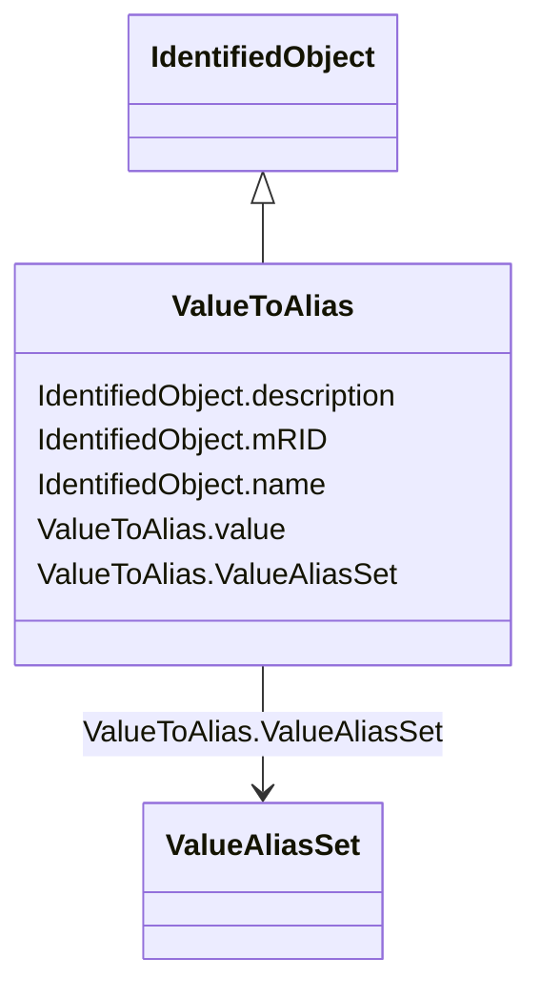

# ValueToAlias

_Describes the translation of one particular value into a name, e.g. 1 as Open._

**URI**: [cim:ValueToAlias](http://iec.ch/TC57/CIM100#ValueToAlias) 
**Type**: Class

## Inheritance
* [IdentifiedObject](IdentifiedObject.md)
    * **ValueToAlias**

## Attributes

| Name | URI | Cardinality and Range | Description | Inheritance |
| ---  | --- | --- | --- | --- |
| value | [cim:ValueToAlias.value](http://iec.ch/TC57/CIM100#ValueToAlias.value) | 1    integer  | The value that is mapped | direct |
| ValueAliasSet | [cim:ValueToAlias.ValueAliasSet](http://iec.ch/TC57/CIM100#ValueToAlias.ValueAliasSet) | 1    [ValueAliasSet](ValueAliasSet.md)  | The ValueAliasSet having the ValueToAlias mappings | direct |
| mRID | [cim:IdentifiedObject.mRID](http://iec.ch/TC57/CIM100#IdentifiedObject.mRID) | 1    string  | Master resource identifier issued by a model authority | [IdentifiedObject](IdentifiedObject.md) |
| description | [cim:IdentifiedObject.description](http://iec.ch/TC57/CIM100#IdentifiedObject.description) | 0..1    string  | The description is a free human readable text describing or naming the object | [IdentifiedObject](IdentifiedObject.md) |
| name | [cim:IdentifiedObject.name](http://iec.ch/TC57/CIM100#IdentifiedObject.name) | 1    string  | The name is any free human readable and possibly non unique text naming the o... | [IdentifiedObject](IdentifiedObject.md) |

## Identifier and Mapping Information

### Schema Source

* from schema: http://iec.ch/TC57/2020/CPSM-Operation#

## Mappings

| Mapping Type | Mapped Value |
| ---  | ---  |
| self | cim:ValueToAlias |
| native | this:ValueToAlias |

