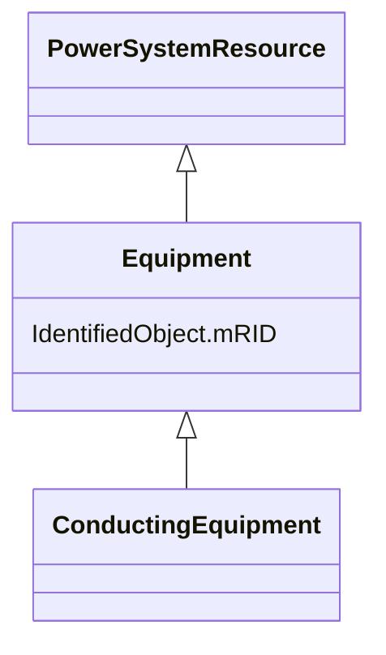

# Equipment

_The parts of a power system that are physical devices, electronic or mechanical._

* __NOTE__: this is an abstract class and should not be instantiated directly

**URI**: [cim:Equipment](http://iec.ch/TC57/CIM100#Equipment) 
**Type**: Class

## Inheritance
* [IdentifiedObject](IdentifiedObject.md)
    * [PowerSystemResource](PowerSystemResource.md)
        * **Equipment**
            * [ConductingEquipment](ConductingEquipment.md)

## Attributes

| Name | URI | Cardinality and Range | Description | Inheritance |
| ---  | --- | --- | --- | --- |
| mRID | [cim:IdentifiedObject.mRID](http://iec.ch/TC57/CIM100#IdentifiedObject.mRID) | 1    string  | Master resource identifier issued by a model authority | [IdentifiedObject](IdentifiedObject.md) |

## Identifier and Mapping Information

### Schema Source

* from schema: http://iec.ch/TC57/2020/CPSM-ShortCircuit#

## Mappings

| Mapping Type | Mapped Value |
| ---  | ---  |
| self | cim:Equipment |
| native | this:Equipment |

