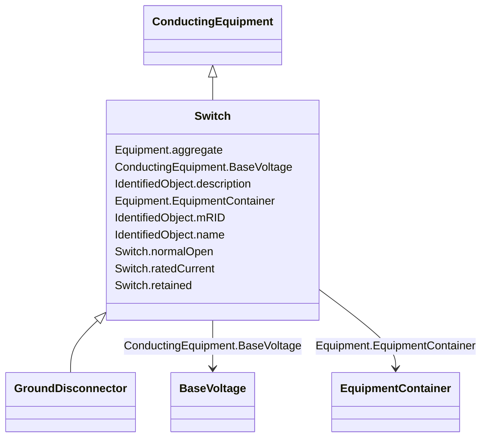

# Switch

_A generic device designed to close, or open, or both, one or more electric circuits.  All switches are two terminal devices including grounding switches._

* __NOTE__: this is an abstract class and should not be instantiated directly

**URI**: [cim:Switch](http://iec.ch/TC57/2013/CIM-schema-cim16#Switch) 
**Type**: Class

## Inheritance
* [IdentifiedObject](IdentifiedObject.md)
    * [PowerSystemResource](PowerSystemResource.md)
        * [Equipment](Equipment.md)
            * [ConductingEquipment](ConductingEquipment.md)
                * **Switch**
                    * [GroundDisconnector](GroundDisconnector.md)

## Attributes

| Name | URI | Cardinality and Range | Description | Inheritance |
| ---  | --- | --- | --- | --- |
| normalOpen | [cim:Switch.normalOpen](http://iec.ch/TC57/2013/CIM-schema-cim16#Switch.normalOpen) | 1    boolean  | The attribute is used in cases when no Measurement for the status value is pr... | direct |
| ratedCurrent | [cim:Switch.ratedCurrent](http://iec.ch/TC57/2013/CIM-schema-cim16#Switch.ratedCurrent) | 0..1    [CurrentFlow](CurrentFlow.md)  | The maximum continuous current carrying capacity in amps governed by the devi... | direct |
| retained | [cim:Switch.retained](http://iec.ch/TC57/2013/CIM-schema-cim16#Switch.retained) | 1    boolean  | Branch is retained in a bus branch model | direct |
| BaseVoltage | [cim:ConductingEquipment.BaseVoltage](http://iec.ch/TC57/2013/CIM-schema-cim16#ConductingEquipment.BaseVoltage) | 0..1    [BaseVoltage](ConductingEquipment.BaseVoltage.md)  | Base voltage of this conducting equipment | [ConductingEquipment](ConductingEquipment.md) |
| aggregate | [cim:Equipment.aggregate](http://iec.ch/TC57/2013/CIM-schema-cim16#Equipment.aggregate) | 0..1    boolean  | The single instance of equipment represents multiple pieces of equipment that... | [Equipment](Equipment.md) |
| EquipmentContainer | [cim:Equipment.EquipmentContainer](http://iec.ch/TC57/2013/CIM-schema-cim16#Equipment.EquipmentContainer) | 0..1    [EquipmentContainer](Equipment.EquipmentContainer.md)  | Container of this equipment | [Equipment](Equipment.md) |
| mRID | [cim:IdentifiedObject.mRID](http://iec.ch/TC57/2013/CIM-schema-cim16#IdentifiedObject.mRID) | 0..1    string  | Master resource identifier issued by a model authority | [IdentifiedObject](IdentifiedObject.md) |
| description | [cim:IdentifiedObject.description](http://iec.ch/TC57/2013/CIM-schema-cim16#IdentifiedObject.description) | 0..1    string  | The description is a free human readable text describing or naming the object | [IdentifiedObject](IdentifiedObject.md) |
| name | [cim:IdentifiedObject.name](http://iec.ch/TC57/2013/CIM-schema-cim16#IdentifiedObject.name) | 1    string  | The name is any free human readable and possibly non unique text naming the o... | [IdentifiedObject](IdentifiedObject.md) |

## Identifier and Mapping Information

### Schema Source

* from schema: http://iec.ch/TC57/2013/CPSM-ShortCircuit#

## Mappings

| Mapping Type | Mapped Value |
| ---  | ---  |
| self | cim:Switch |
| native | this:Switch |

