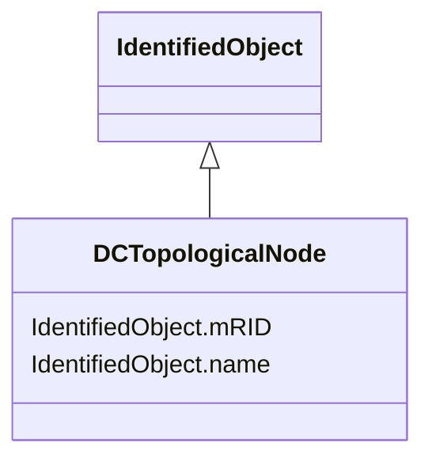

# DCTopologicalNode

_DC bus._

* __NOTE__: this is an abstract class and should not be instantiated directly

**URI**: [cim:DCTopologicalNode](http://iec.ch/TC57/CIM100#DCTopologicalNode) 
**Type**: Class

## Inheritance
* [IdentifiedObject](IdentifiedObject.md)
    * **DCTopologicalNode**

## Attributes

| Name | URI | Cardinality and Range | Description | Inheritance |
| ---  | --- | --- | --- | --- |
| mRID | [cim:IdentifiedObject.mRID](http://iec.ch/TC57/CIM100#IdentifiedObject.mRID) | 1    string  | Master resource identifier issued by a model authority | [IdentifiedObject](IdentifiedObject.md) |
| name | [cim:IdentifiedObject.name](http://iec.ch/TC57/CIM100#IdentifiedObject.name) | 1    string  | The name is any free human readable and possibly non unique text naming the o... | [IdentifiedObject](IdentifiedObject.md) |

## Usages

| used by | used in | type | used |
| ---  | --- | --- | --- |
| [DCTopologicalIsland](DCTopologicalIsland.md) | DCTopologicalNodes | range | [DCTopologicalNode](DCTopologicalNode.md) |

## Identifier and Mapping Information

### Schema Source

* from schema: http://iec.ch/TC57/ns/CIM/StateVariables/5.0#

## Mappings

| Mapping Type | Mapped Value |
| ---  | ---  |
| self | cim:DCTopologicalNode |
| native | this:DCTopologicalNode |

