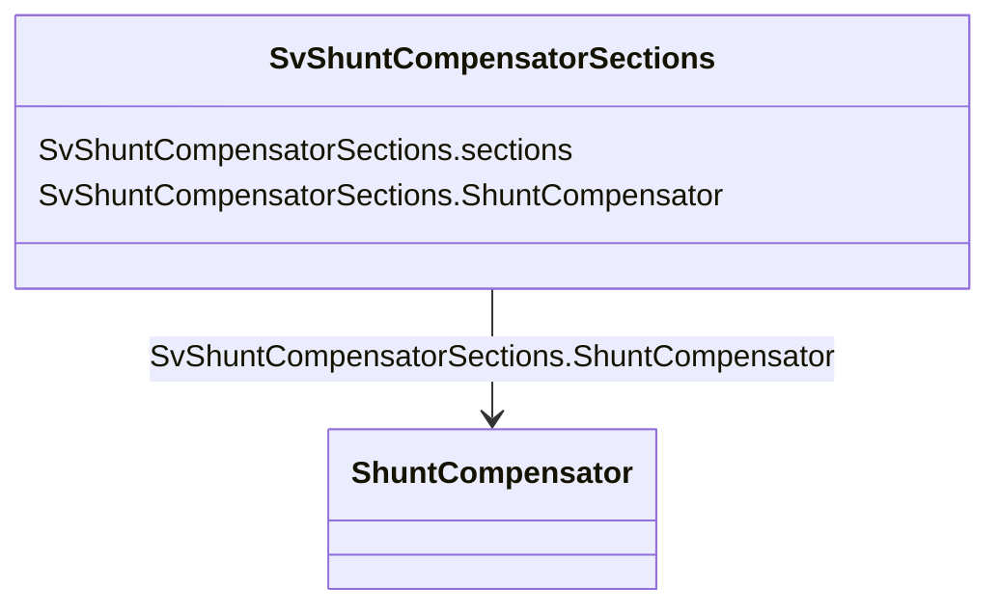

# SvShuntCompensatorSections

_State variable for the number of sections in service for a shunt compensator._

**URI**: [cim:SvShuntCompensatorSections](http://iec.ch/TC57/CIM100#SvShuntCompensatorSections) 
**Type**: Class

<!-- no inheritance hierarchy -->

## Attributes

| Name | URI | Cardinality and Range | Description | Inheritance |
| ---  | --- | --- | --- | --- |
| sections | [cim:SvShuntCompensatorSections.sections](http://iec.ch/TC57/CIM100#SvShuntCompensatorSections.sections) | 1    float  | The number of sections in service as a continuous variable | direct |
| ShuntCompensator | [cim:SvShuntCompensatorSections.ShuntCompensator](http://iec.ch/TC57/CIM100#SvShuntCompensatorSections.ShuntCompensator) | 1    [ShuntCompensator](ShuntCompensator.md)  | The shunt compensator for which the state applies | direct |

## Identifier and Mapping Information

### Schema Source

* from schema: http://iec.ch/TC57/ns/CIM/StateVariables/5.0#

## Mappings

| Mapping Type | Mapped Value |
| ---  | ---  |
| self | cim:SvShuntCompensatorSections |
| native | this:SvShuntCompensatorSections |

