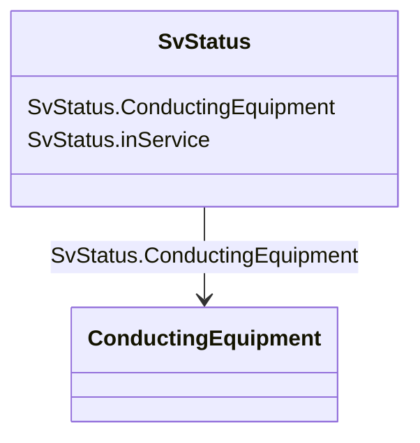

# SvStatus

_State variable for status._

**URI**: [cim:SvStatus](http://iec.ch/TC57/CIM100#SvStatus) 
**Type**: Class

<!-- no inheritance hierarchy -->

## Attributes

| Name | URI | Cardinality and Range | Description | Inheritance |
| ---  | --- | --- | --- | --- |
| inService | [cim:SvStatus.inService](http://iec.ch/TC57/CIM100#SvStatus.inService) | 1    boolean  | The in service status as a result of topology processing | direct |
| ConductingEquipment | [cim:SvStatus.ConductingEquipment](http://iec.ch/TC57/CIM100#SvStatus.ConductingEquipment) | 1    [ConductingEquipment](ConductingEquipment.md)  | The conducting equipment associated with the status state variable | direct |

## Identifier and Mapping Information

### Schema Source

* from schema: http://iec.ch/TC57/ns/CIM/StateVariables/5.0#

## Mappings

| Mapping Type | Mapped Value |
| ---  | ---  |
| self | cim:SvStatus |
| native | this:SvStatus |

