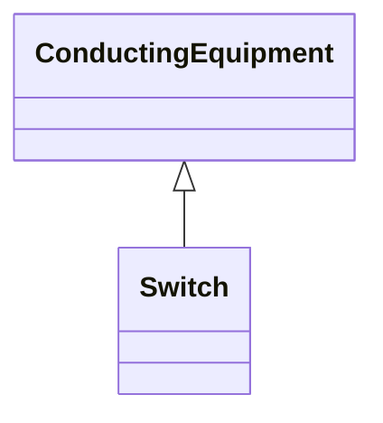

# Switch

_A generic device designed to close, or open, or both, one or more electric circuits.  All switches are two terminal devices including grounding switches. The ACDCTerminal.connected at the two sides of the switch shall not be considered for assessing switch connectivity, i.e. only Switch.open, .normalOpen and .locked are relevant._

* __NOTE__: this is an abstract class and should not be instantiated directly

**URI**: [cim:Switch](http://iec.ch/TC57/CIM100#Switch) 
**Type**: Class

## Inheritance
* [ConductingEquipment](ConductingEquipment.md)
    * **Switch**

## Attributes

| Name | URI | Cardinality and Range | Description | Inheritance |
| ---  | --- | --- | --- | --- |

## Usages

| used by | used in | type | used |
| ---  | --- | --- | --- |
| [SvSwitch](SvSwitch.md) | Switch | range | [Switch](Switch.md) |

## Identifier and Mapping Information

### Schema Source

* from schema: http://iec.ch/TC57/ns/CIM/StateVariables/5.0#

## Mappings

| Mapping Type | Mapped Value |
| ---  | ---  |
| self | cim:Switch |
| native | this:Switch |

