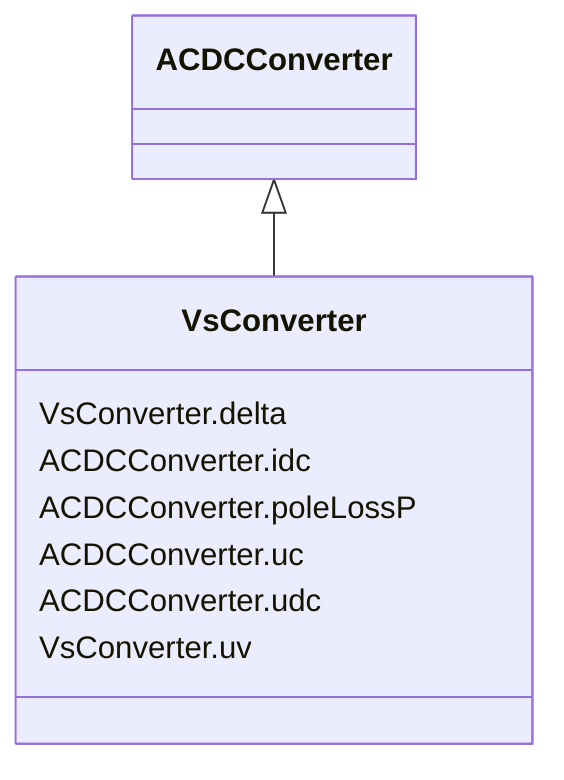

# VsConverter

_DC side of the voltage source converter (VSC)._

**URI**: [cim:VsConverter](http://iec.ch/TC57/CIM100#VsConverter) 
**Type**: Class

## Inheritance
* [ConductingEquipment](ConductingEquipment.md)
    * [ACDCConverter](ACDCConverter.md)
        * **VsConverter**

## Attributes

| Name | URI | Cardinality and Range | Description | Inheritance |
| ---  | --- | --- | --- | --- |
| delta | [cim:VsConverter.delta](http://iec.ch/TC57/CIM100#VsConverter.delta) | 1    [AngleDegrees](AngleDegrees.md)  | Angle between VsConverter | direct |
| uv | [cim:VsConverter.uv](http://iec.ch/TC57/CIM100#VsConverter.uv) | 1    [Voltage](Voltage.md)  | Line-to-line voltage on the valve side of the converter transformer | direct |
| idc | [cim:ACDCConverter.idc](http://iec.ch/TC57/CIM100#ACDCConverter.idc) | 1    [CurrentFlow](CurrentFlow.md)  | Converter DC current, also called Id | [ACDCConverter](ACDCConverter.md) |
| poleLossP | [cim:ACDCConverter.poleLossP](http://iec.ch/TC57/CIM100#ACDCConverter.poleLossP) | 1    [ActivePower](ActivePower.md)  | The active power loss at a DC Pole= idleLoss + switchingLoss*|Idc| + resitive... | [ACDCConverter](ACDCConverter.md) |
| uc | [cim:ACDCConverter.uc](http://iec.ch/TC57/CIM100#ACDCConverter.uc) | 1    [Voltage](Voltage.md)  | Line-to-line converter voltage, the voltage at the AC side of the valve | [ACDCConverter](ACDCConverter.md) |
| udc | [cim:ACDCConverter.udc](http://iec.ch/TC57/CIM100#ACDCConverter.udc) | 1    [Voltage](Voltage.md)  | Converter voltage at the DC side, also called Ud | [ACDCConverter](ACDCConverter.md) |

## Identifier and Mapping Information

### Schema Source

* from schema: http://iec.ch/TC57/ns/CIM/StateVariables/5.0#

## Mappings

| Mapping Type | Mapped Value |
| ---  | ---  |
| self | cim:VsConverter |
| native | this:VsConverter |

