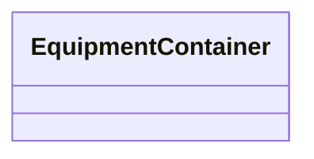

# EquipmentContainer

_A modelling construct to provide a root class for containing equipment._

* __NOTE__: this is an abstract class and should not be instantiated directly

**URI**: [cim:EquipmentContainer](http://iec.ch/TC57/CIM100#EquipmentContainer) 
**Type**: Class

<!-- no inheritance hierarchy -->

## Attributes

| Name | URI | Cardinality and Range | Description | Inheritance |
| ---  | --- | --- | --- | --- |

## Identifier and Mapping Information

### Schema Source

* from schema: http://iec.ch/TC57/ns/CIM/SteadyStateHypothesis/2.0#

## Mappings

| Mapping Type | Mapped Value |
| ---  | ---  |
| self | cim:EquipmentContainer |
| native | this:EquipmentContainer |

