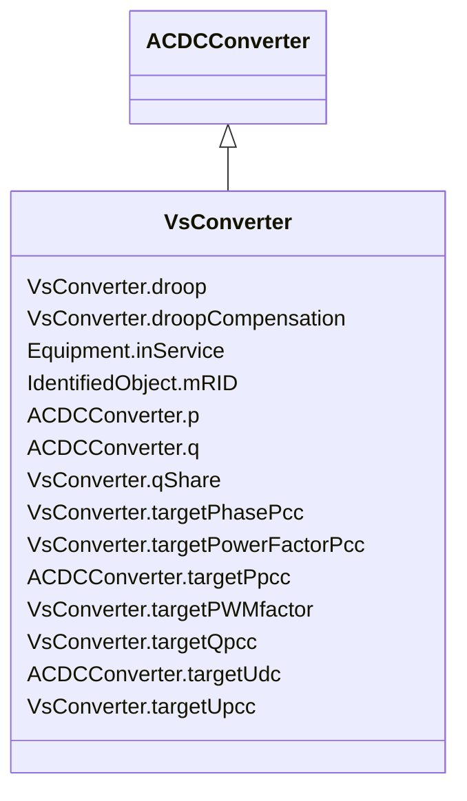

# VsConverter

_DC side of the voltage source converter (VSC)._

**URI**: [cim:VsConverter](http://iec.ch/TC57/CIM100#VsConverter) 
**Type**: Class

## Inheritance
* [IdentifiedObject](IdentifiedObject.md)
    * [PowerSystemResource](PowerSystemResource.md)
        * [Equipment](Equipment.md)
            * [ConductingEquipment](ConductingEquipment.md)
                * [ACDCConverter](ACDCConverter.md)
                    * **VsConverter**

## Attributes

| Name | URI | Cardinality and Range | Description | Inheritance |
| ---  | --- | --- | --- | --- |
| droop | [cim:VsConverter.droop](http://iec.ch/TC57/CIM100#VsConverter.droop) | 0..1    [PU](PU.md)  | Droop constant | direct |
| droopCompensation | [cim:VsConverter.droopCompensation](http://iec.ch/TC57/CIM100#VsConverter.droopCompensation) | 0..1    [Resistance](Resistance.md)  | Compensation constant | direct |
| qShare | [cim:VsConverter.qShare](http://iec.ch/TC57/CIM100#VsConverter.qShare) | 0..1    [PerCent](PerCent.md)  | Reactive power sharing factor among parallel converters on Uac control | direct |
| targetPhasePcc | [cim:VsConverter.targetPhasePcc](http://iec.ch/TC57/CIM100#VsConverter.targetPhasePcc) | 0..1    [AngleDegrees](AngleDegrees.md)  | Phase target at AC side, at point of common coupling | direct |
| targetPowerFactorPcc | [cim:VsConverter.targetPowerFactorPcc](http://iec.ch/TC57/CIM100#VsConverter.targetPowerFactorPcc) | 0..1    float  | Power factor target at the AC side, at point of common coupling | direct |
| targetPWMfactor | [cim:VsConverter.targetPWMfactor](http://iec.ch/TC57/CIM100#VsConverter.targetPWMfactor) | 0..1    float  | Magnitude of pulse-modulation factor | direct |
| targetQpcc | [cim:VsConverter.targetQpcc](http://iec.ch/TC57/CIM100#VsConverter.targetQpcc) | 0..1    [ReactivePower](ReactivePower.md)  | Reactive power injection target in AC grid, at point of common coupling | direct |
| targetUpcc | [cim:VsConverter.targetUpcc](http://iec.ch/TC57/CIM100#VsConverter.targetUpcc) | 0..1    [Voltage](Voltage.md)  | Voltage target in AC grid, at point of common coupling | direct |
| p | [cim:ACDCConverter.p](http://iec.ch/TC57/CIM100#ACDCConverter.p) | 1    [ActivePower](ActivePower.md)  | Active power at the point of common coupling | [ACDCConverter](ACDCConverter.md) |
| q | [cim:ACDCConverter.q](http://iec.ch/TC57/CIM100#ACDCConverter.q) | 1    [ReactivePower](ReactivePower.md)  | Reactive power at the point of common coupling | [ACDCConverter](ACDCConverter.md) |
| targetPpcc | [cim:ACDCConverter.targetPpcc](http://iec.ch/TC57/CIM100#ACDCConverter.targetPpcc) | 0..1    [ActivePower](ActivePower.md)  | Real power injection target in AC grid, at point of common coupling | [ACDCConverter](ACDCConverter.md) |
| targetUdc | [cim:ACDCConverter.targetUdc](http://iec.ch/TC57/CIM100#ACDCConverter.targetUdc) | 0..1    [Voltage](Voltage.md)  | Target value for DC voltage magnitude | [ACDCConverter](ACDCConverter.md) |
| inService | [cim:Equipment.inService](http://iec.ch/TC57/CIM100#Equipment.inService) | 1    boolean  | Specifies the availability of the equipment | [Equipment](Equipment.md) |
| mRID | [cim:IdentifiedObject.mRID](http://iec.ch/TC57/CIM100#IdentifiedObject.mRID) | 1    string  | Master resource identifier issued by a model authority | [IdentifiedObject](IdentifiedObject.md) |

## Identifier and Mapping Information

### Schema Source

* from schema: http://iec.ch/TC57/ns/CIM/SteadyStateHypothesis/2.0#

## Mappings

| Mapping Type | Mapped Value |
| ---  | ---  |
| self | cim:VsConverter |
| native | this:VsConverter |

