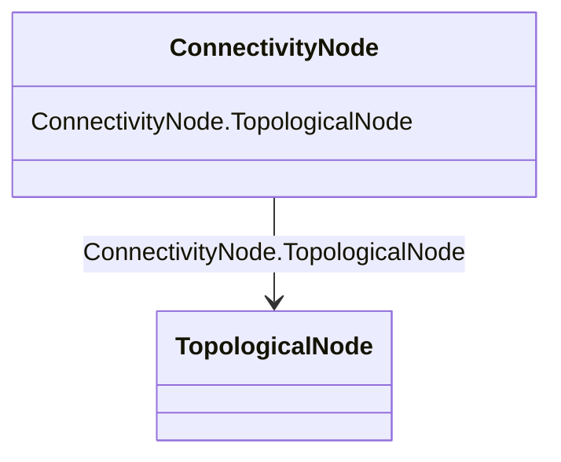

# ConnectivityNode

_Connectivity nodes are points where terminals of AC conducting equipment are connected together with zero impedance._

**URI**: [cim:ConnectivityNode](http://iec.ch/TC57/CIM100#ConnectivityNode) 
**Type**: Class

<!-- no inheritance hierarchy -->

## Attributes

| Name | URI | Cardinality and Range | Description | Inheritance |
| ---  | --- | --- | --- | --- |
| TopologicalNode | [cim:ConnectivityNode.TopologicalNode](http://iec.ch/TC57/CIM100#ConnectivityNode.TopologicalNode) | 1    [TopologicalNode](TopologicalNode.md)  | The topological node to which this connectivity node is assigned | direct |

## Identifier and Mapping Information

### Schema Source

* from schema: http://iec.ch/TC57/ns/CIM/Topology/5.0#

## Mappings

| Mapping Type | Mapped Value |
| ---  | ---  |
| self | cim:ConnectivityNode |
| native | this:ConnectivityNode |

