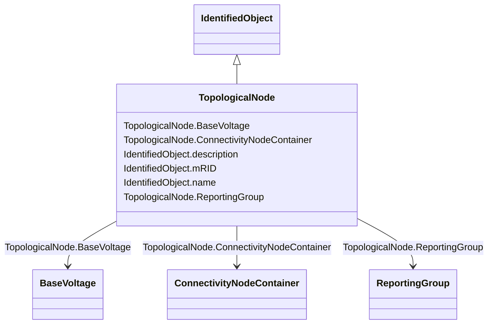

# TopologicalNode

_For a detailed substation model a topological node is a set of connectivity nodes that, in the current network state, are connected together through any type of closed switches, including  jumpers. Topological nodes change as the current network state changes (i.e., switches, breakers, etc. change state).For a planning model, switch statuses are not used to form topological nodes. Instead they are manually created or deleted in a model builder tool. Topological nodes maintained this way are also called busses._

**URI**: [cim:TopologicalNode](http://iec.ch/TC57/CIM100#TopologicalNode) 
**Type**: Class

## Inheritance
* [IdentifiedObject](IdentifiedObject.md)
    * **TopologicalNode**

## Attributes

| Name | URI | Cardinality and Range | Description | Inheritance |
| ---  | --- | --- | --- | --- |
| BaseVoltage | [cim:TopologicalNode.BaseVoltage](http://iec.ch/TC57/CIM100#TopologicalNode.BaseVoltage) | 1    [BaseVoltage](BaseVoltage.md)  | The base voltage of the topological node | direct |
| ConnectivityNodeContainer | [cim:TopologicalNode.ConnectivityNodeContainer](http://iec.ch/TC57/CIM100#TopologicalNode.ConnectivityNodeContainer) | 1    [ConnectivityNodeContainer](ConnectivityNodeContainer.md)  | The connectivity node container to which the topological node belongs | direct |
| ReportingGroup | [cim:TopologicalNode.ReportingGroup](http://iec.ch/TC57/CIM100#TopologicalNode.ReportingGroup) | 0..1    [ReportingGroup](ReportingGroup.md)  | The reporting group to which the topological node belongs | direct |
| mRID | [cim:IdentifiedObject.mRID](http://iec.ch/TC57/CIM100#IdentifiedObject.mRID) | 1    string  | Master resource identifier issued by a model authority | [IdentifiedObject](IdentifiedObject.md) |
| description | [cim:IdentifiedObject.description](http://iec.ch/TC57/CIM100#IdentifiedObject.description) | 0..1    string  | The description is a free human readable text describing or naming the object | [IdentifiedObject](IdentifiedObject.md) |
| name | [cim:IdentifiedObject.name](http://iec.ch/TC57/CIM100#IdentifiedObject.name) | 0..1    string  | The name is any free human readable and possibly non unique text naming the o... | [IdentifiedObject](IdentifiedObject.md) |

## Usages

| used by | used in | type | used |
| ---  | --- | --- | --- |
| [ConnectivityNode](ConnectivityNode.md) | TopologicalNode | range | [TopologicalNode](TopologicalNode.md) |
| [Terminal](Terminal.md) | TopologicalNode | range | [TopologicalNode](TopologicalNode.md) |

## Identifier and Mapping Information

### Schema Source

* from schema: http://iec.ch/TC57/ns/CIM/Topology/5.0#

## Mappings

| Mapping Type | Mapped Value |
| ---  | ---  |
| self | cim:TopologicalNode |
| native | this:TopologicalNode |

